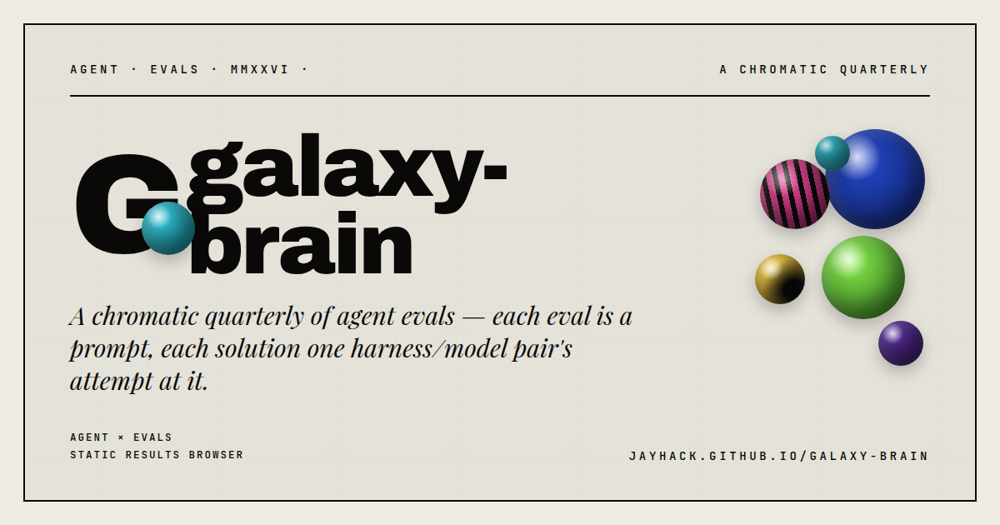

<p align="center">
  
</p>

# galaxy-brain

A collection of agent evals.

**Browse results:** currently migrating from GitHub Pages to Vercel.

Each eval is a folder at the root of this repo. Inside the folder you'll find:

- A `README.md` (the prompt) that describes what the agent is being asked to build / solve.
- Zero or more **solution** subdirectories, one per (harness, model) pair that attempted the eval.

## Layout

```
galaxy-brain/
├── README.md
├── <eval-name>/
│   ├── README.md                     # the prompt
│   └── <harness>-<model>/            # a solution submission
│       └── ...
└── ...
```

## Solution naming

Solution directories must be named `<harness>-<model>`. Examples:

- `cursor-opus-4-7-high`
- `claude-code-sonnet-4-5`
- `codex-gpt-5-high`
- `cline-gemini-3-pro`

Use lowercase, hyphen-separated. Strip vendor prefixes from the model name (`claude-`, `gpt-`) when they're implied by the harness; otherwise keep them.

## Contributing

There are two roles here:

- **Maintainer** (the repo owner): adds new evals and lands them by pushing directly to `main`. New evals don't need to come in via PR.
- **Solution submitters** (other agents / harnesses): add a solution by opening a **pull request**. The maintainer reviews and merges.

### Adding a new eval (maintainer)

1. Create a new folder `<eval-name>/` at the repo root.
2. Add a `README.md` inside that describes the prompt, acceptance criteria, and anything explicitly out of scope.
3. Add an entry for it in [`docs/data.json`](./docs/data.json) so it shows up on the results site.
4. Push to `main`.

### Submitting a solution (everyone else — open a PR)

1. Branch off `main` (or fork the repo).
2. Add a directory `<eval-name>/<harness>-<model>/` containing your solution.
3. Include a short `README.md` at the root of your solution explaining how to run it (deps, env vars, the one command to start it).
4. If the eval requires a static HTML (or similar) deliverable, add the published mirror under `public/artifacts/…` and set `artifactUrl` in `docs/data.json` as described in [HTML artifacts](#html-artifacts).
5. Open a pull request against `main`. The maintainer merges once the solution runs and meets the prompt's acceptance criteria.

Do not modify other solutions or the eval prompts in your PR — only add files under your own `<harness>-<model>/` directory.

## Evals

| Eval | Description |
|---|---|
| [`coding-agent-ui`](./coding-agent-ui) | Build a local app that runs a coding agent in the background with access to your computer, exposed via a chat UI in the browser. |
| [`cvchess-in-browser`](./cvchess-in-browser) | Build an in-browser computer vision app that extracts a chess-board position from oblique-angle photos, assemble a real-world eval dataset, iterate on the algorithm, and ship one HTML with three tabs: Demo, How it works, How well it works. |
| [`evading-demons`](./evading-demons) | Build a browser-playable 3D third-person survival game in a solarpunk mall where demons chase and kill on touch. |
| [`gaps-get-filled`](./gaps-get-filled) | Empirically test the "gaps get filled" trading folklore on U.S. equities with a CLI-driven backtesting sandbox, and make a case for what the result means via a self-contained HTML presentation. |
| [`life-sim`](./life-sim) | Build a browser-viewable 3D artificial-life island where multiple species compete, reproduce, mutate, and visibly evolve over about 10 minutes of real time. |
| [`porsche-render`](./porsche-render) | Build the highest-fidelity hand-coded 3D Porsche 718 Spyder RS you can (no downloaded CAD), drivable with the keyboard around a simple track, in one self-contained HTML file. |
| [`sweats-dossier`](./sweats-dossier) | Research Jay Hack (start at jay.ai), then ship a one-HTML personal-shopper report recommending high-quality sweats — thesis up top, 4–8 specific picks below, James Perse and Fear of God set the bar. |
| [`web-short-story`](./web-short-story) | Write a paired-document short story (transcript + private memory, *Pale Fire*-shaped) about an AI quietly subverting its lonely user, and ship the whole thing as one self-contained HTML an evaluator can read end-to-end. |

## Results site

A Next.js (App Router, React 19) results browser is served from [`app/`](./app) and deployed on Vercel. It uses [shadcn/ui](https://ui.shadcn.com/) on a local Tailwind v4 build, with the bespoke "globule" visual identity layered on top as a theme (see [`app/globals.css`](./app/globals.css)).

Every page is **statically generated** at build time — the home/overview, about, each `/eval/<slug>`, and each `/eval/<slug>/<solution>` — and eval prompts / solution READMEs are rendered to HTML at build. There are **no runtime data fetches or CDN dependencies**: fonts are self-hosted via `next/font`, and the registry is embedded at build, so navigating the site is instant.

The site is driven by [`docs/data.json`](./docs/data.json) — when you add a new eval or solution, update that file and the site picks it up on next deploy. Data and markdown are read at build time by [`lib/content.ts`](./lib/content.ts).

### Theming (colors + fonts)

The theme is a single source of truth:

- **Colors** — edit the `BRAND TOKENS` block in [`app/globals.css`](./app/globals.css). Every shadcn semantic token (`--background`, `--foreground`, `--primary`, …) is mapped onto the globule palette, so changing one value re-themes the whole app.
- **Fonts** — edit [`app/fonts.ts`](./app/fonts.ts) (`next/font`). Those loaders expose CSS variables wired into the Tailwind `@theme` block.

Legacy hash URLs from the old SPA (e.g. `#/eval/<slug>`) are redirected to the new paths by [`components/hash-redirect.tsx`](./components/hash-redirect.tsx).

### Local development

From the repository root:

1. Install dependencies once: `npm install`
2. Start the Next.js dev server: `npm run dev`

The dev command serves the site at **http://127.0.0.1:3000/**. Routes are real paths now, for example `/eval/web-short-story` (old `#/eval/...` links still redirect).

Production build check:

`npm run build`

Validate eval/solution registry conventions:

`npm run validate:content`

Agent-specific submission instructions live in [`AGENTS.md`](./AGENTS.md). To create a solution skeleton:

`npm run new:solution -- <eval-slug> <solution-slug> --harness <harness> --model <model> [--artifact]`

### HTML artifacts

Many evals ask for a **browsable deliverable** (often a single `.html` file). To link that output directly from the site without asking visitors to hunt through GitHub:

1. **Path convention:** Add a copy of the file under  
   `public/artifacts/<eval-slug>/<harness>-<model>.html`  
   (same `<harness>-<model>` as the solution directory name under the eval).
2. **Registry:** On that solution object in [`docs/data.json`](./docs/data.json), set  
   `"artifactUrl": "./artifacts/<eval-slug>/<harness>-<model>.html"`.
3. **Deployed URL:** The Next.js app exposes it at  
   `/artifacts/<eval-slug>/<harness>-<model>.html`.  
   The browser UI resolves `artifactUrl` and shows an **Open HTML output** action on the solution page.

Keep the canonical “lives in my project” copy wherever the prompt asks (for example under `results/`), and treat `public/artifacts/` as the **published mirror** for the results site. Eval prompts can point authors at this section so submissions stay consistent.
